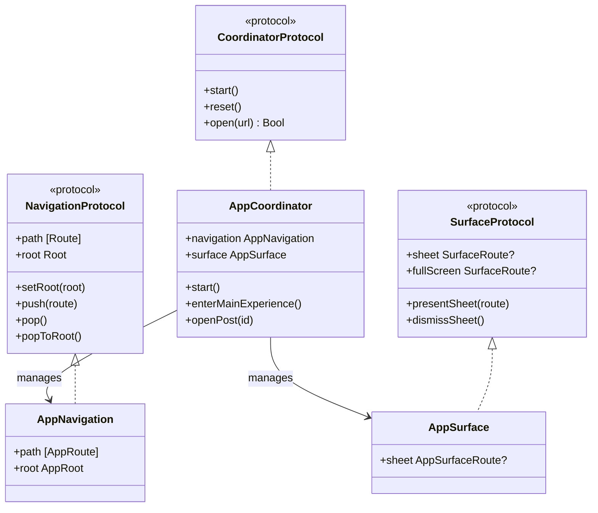

# Coordinator & Navigation Stack Architecture

This document describes the design, implementation, and routing patterns of the navigation system in **iOS16Navigation**.

---

## 🏛️ The Coordinator Pattern in SwiftUI

The **Coordinator Pattern** decouples views from their navigation flows. In SwiftUI, views typically trigger transitions by interacting directly with parent views or using localized state flags (like `.sheet` or `NavigationLink` bindings). This project abstracts that logic into a centralized `AppCoordinator`, providing several key advantages:

1.  **Separation of Concerns**: Views only render content and capture user actions; they do not know *where* to route next or *how* to construct the destination view.
2.  **Unified State Manager**: A single class contains all navigation state, enabling complex operations like resetting the entire view hierarchy or resolving deep links across different navigation roots.
3.  **Modular & Reusable**: It becomes simple to swap out or reuse modules since views rely purely on dependencies or environment coordinates.

---

## 🧭 Core Architectural Components

The navigation architecture revolves around three protocols located in the [Core/Protocol](file:///Users/raf/Development/Swift/Example/iOS16Navigation/iOS16Navigation/Core/Protocol/) directory:



### 1. Navigation State: [AppNavigation](file:///Users/raf/Development/Swift/Example/iOS16Navigation/iOS16Navigation/Core/Protocol/NavigationProtocol.swift)
An `ObservableObject` that wraps:
*   `root`: The currently active root-level state of the application.
*   `path`: A collection of routes forming the active navigation stack.

```swift
public class AppNavigation<Route: Hashable, Root: Hashable>: ObservableObject, NavigationProtocol {
    @Published public var path: [Route] = []
    @Published public var root: Root
    ...
}
```

### 2. Concrete Coordinator: [AppCoordinator](file:///Users/raf/Development/Swift/Example/iOS16Navigation/iOS16Navigation/Application/Coordinator/AppCoordinator.swift)
The orchestrator of all navigation events. It receives user actions from views, parses deep links, manages the navigation path, and triggers root transitions or modals.

---

## 🪵 Root View Swapping

At the top level, the application utilizes state-driven view swapping to transition between high-level application flows defined by the `AppRoot` enum:

```swift
enum AppRoot: Hashable {
    case splash      // App launch, branding animations
    case login       // Authentication gates
    case main        // Tab bar + content exploration
}
```

### The Transition Pipeline
Root swaps are managed in [ContentView](file:///Users/raf/Development/Swift/Example/iOS16Navigation/iOS16Navigation/Application/ContentView.swift) within a SwiftUI `ZStack`:

```swift
ZStack {
    switch navigation.root {
    case .splash:
        SplashView()
            .transition(rootTransition)
    case .login:
        LoginView()
            .transition(rootTransition)
    case .main:
        NavigationStack(path: $navigation.path) {
            MainTabView()
                .navigationDestination(for: AppRoute.self) { route in
                    destinationView(for: route)
                }
        }
        .transition(rootTransition)
    }
}
.id(navigation.root)
```

Root switches use **asymmetric transitions** configured in [ContentView](file:///Users/raf/Development/Swift/Example/iOS16Navigation/iOS16Navigation/Application/ContentView.swift):
*   **Splash to Login**: Moves upward (`offset(y: 36)`) and fades in while the splash screen shrinks and fades out.
*   **Login to Main**: Slides in from the right (`offset(x: 44)`) and fades out to the left.
*   **Main to Login (e.g., Session Expired/Logout)**: Slides back in from the left and exits to the right.

---

## 🗂️ The Navigation Stack & Router

Once in the `.main` root, the application uses a single SwiftUI `NavigationStack` bound to `navigation.path` of type `[AppRoute]`. 

### Pushed Routes: `AppRoute`
The navigation stack is modeled by the `AppRoute` enum, capturing standard social detail screens:

```swift
enum AppRoute: Hashable {
    case postDetail(id: String, sourceID: String? = nil)
    case comments(postID: String)
    case profile(username: String)
}
```

### Inter-View Pushing
Views do not append items directly to `navigation.path`. Instead, they notify the coordinator:

```swift
// In a Feed view component:
@EnvironmentObject private var coordinator: AppCoordinator

Button("Read Post") {
    coordinator.openPost(id: post.id)
}
```

The coordinator then modifies the underlying path:

```swift
// In AppCoordinator.swift
func openPost(id: String) {
    navigation.push(.postDetail(id: id, sourceID: nil))
}
```

This structural isolation ensures that routing rules (such as blocking certain navigation if the user is unauthenticated or verifying whether a post exists) can be evaluated centrally inside the coordinator rather than leaking into layout views.
