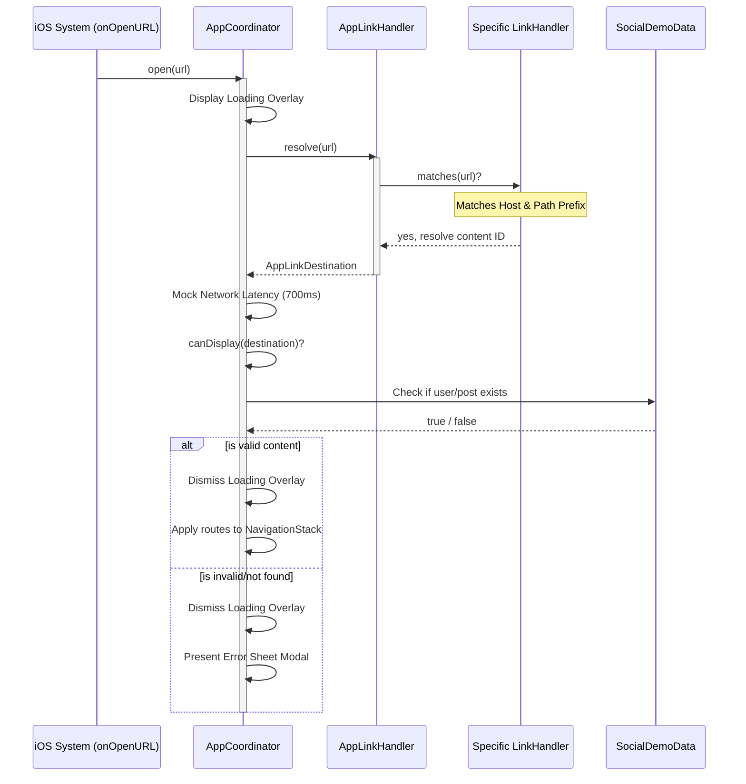

# Asynchronous Deep Linking

This document outlines the architecture, pipeline, and testing commands for deep linking in **iOS16Navigation**.

---

## 🔗 Deep Link Architecture Overview

The deep link subsystem is decoupled from the UI. It uses a **Chain of Responsibility (Router)** design pattern to register individual path handlers. When an incoming URL is intercepted by the application, it passes through this pipeline to resolve to an explicit destination.



---

## 🛠️ The Processing Pipeline

### 1. Interception: `onOpenURL`
In [ContentView](file:///Users/raf/Development/Swift/Example/iOS16Navigation/iOS16Navigation/Application/ContentView.swift), the application listens for URL schemes or Universal Links:

```swift
rootView
    .onOpenURL { url in
        coordinator.open(url: url)
    }
```

### 2. Resolution: [AppLinkHandler](file:///Users/raf/Development/Swift/Example/iOS16Navigation/iOS16Navigation/Application/AppLink/AppLinkHandler.swift)
The coordinator calls `AppLinkHandler.resolve(url:)`. The handler loops through registered handlers:

*   [PostLinkHandler](file:///Users/raf/Development/Swift/Example/iOS16Navigation/iOS16Navigation/Application/AppLink/Item/PostLinkHandler.swift): Handles `/post/<id>`
*   [CommentsLinkHandler](file:///Users/raf/Development/Swift/Example/iOS16Navigation/iOS16Navigation/Application/AppLink/Item/CommentsLinkHandler.swift): Handles `/post/<id>/comments`
*   [ProfileLinkHandler](file:///Users/raf/Development/Swift/Example/iOS16Navigation/iOS16Navigation/Application/AppLink/Item/ProfileLinkHandler.swift): Handles `/profile/<username>`

If none match, it throws `LinkHandlerError.unsupportedURL`.

### 3. Simulation & Validation: [AppCoordinator](file:///Users/raf/Development/Swift/Example/iOS16Navigation/iOS16Navigation/Application/Coordinator/AppCoordinator.swift)
To model real-world scenarios, the coordinator resolution performs three steps:
1.  **Latency**: Pauses execution for `700ms` (`Task.sleep(for: .milliseconds(700))`) during which a **floating loading overlay** is presented.
2.  **Existence Check**: Checks if the target entity exists in the local data model (`canDisplay`):
    ```swift
    func canDisplay(_ destination: AppLinkDestination) -> Bool {
        switch destination {
        case .post(let id), .comments(let id):
            SocialDemoData.post(id: id) != nil
        case .profile(let username):
            SocialDemoData.user(username: username) != nil
        }
    }
    ```
3.  **Application**: If valid, the coordinator updates the root and replaces the navigation stack:
    ```swift
    case .comments(let postID):
        withAnimation {
            navigation.setRoot(.main)
            navigation.setStack([
                .postDetail(id: postID, sourceID: nil),
                .comments(postID: postID)
            ])
        }
    ```
    If invalid or unsupported, it displays the `.error` sheet modal.

---

## 🧪 Testing Deep Links

You can test the deep linking flows in two ways: using internal demo controls or external system commands.

### Option A: Explore Screen Demo Controls
The **Explore** tab in the application contains buttons that dispatch demo URLs directly to the coordinator. 
*   **Valid URL buttons** instantly resolve and route you to details.
*   **Invalid URL buttons** show a loading indicator, then open the error dialog.

### Option B: Terminal Command Line (Simulator)
Ensure your simulator is booted and the app is active, then execute the following commands in your shell:

#### 1. Navigate to a Post Detail (Valid)
Using Custom Scheme:
```bash
xcrun simctl openurl booted "com.arafs.iOS16Navigation://post/p1"
```
Using HTTPS Universal Link:
```bash
xcrun simctl openurl booted "https://www.example.com/post/p1"
```

#### 2. Navigate to Comments (Valid)
Pushes the Post Detail view followed by the Comments view onto the stack:
Using Custom Scheme:
```bash
xcrun simctl openurl booted "com.arafs.iOS16Navigation://comments/post-comment-prompts"
```
Using HTTPS Universal Link:
```bash
xcrun simctl openurl booted "https://www.example.com/comments/post-comment-prompts"
```

#### 3. Navigate to a User Profile (Valid)
Using Custom Scheme:
```bash
xcrun simctl openurl booted "com.arafs.iOS16Navigation://profile/alice_w"
```
Using HTTPS Universal Link:
```bash
xcrun simctl openurl booted "https://www.example.com/profile/alice_w"
```

#### 4. Invalid Entity ID (Triggers Error Sheet)
Requests a post that does not exist in the mock dataset:
```bash
xcrun simctl openurl booted "com.arafs.iOS16Navigation://post/p999"
```

#### 5. Unsupported Host/Path (Triggers Error Sheet)
```bash
xcrun simctl openurl booted "com.arafs.iOS16Navigation://invalid"
```
